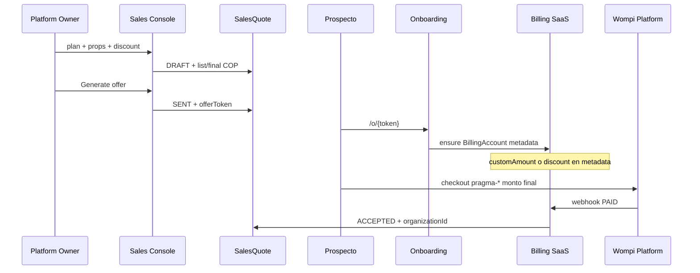

# Post-launch: Owner Sales Console / Custom Quote / Private Offer

**Decisión (auditoría release-stable):** **POST-LAUNCH (Sprint B)** — no implementar antes del push actual.

**PRAGMA sigue FINAL PUSH-READY** sin cambios en rutas release-critical.

---

## 1. Por qué NO es safe pre-push

| Criterio | Evaluación |
|----------|------------|
| Toca billing SaaS core | **Sí** — montos de factura, `syncOpenInvoiceAmountForAccount`, checkout Wompi `pragma-*` |
| Toca Wompi SaaS de forma riesgosa | **Sí** — oferta con precio distinto al catálogo exige monto custom en checkout o override de invoice |
| Toca onboarding | **Sí** — “private offer link” implica signup/checkout con plan + slots + descuento pre-aplicados |
| Migraciones riesgosas | **Sí** — historial, quotes, tokens, audit persistente |
| Refactor grande | **Medio-alto** — nuevo módulo + integración con billing existente |
| Multi-tenant | **Sí** — quotes por prospecto/tenant, aislamiento owner-only |
| Código existente | **Ninguno** — no hay `quote`, `offer`, `sales` en `src/` |

Una “calculadora solo UI” sin persistencia ni offer link **no cumple** el alcance pedido y aún añade superficie owner pre-launch sin valor release-critical.

---

## 2. Qué existe hoy (reutilizable post-launch)

| Pieza | Ubicación | Uso en Sales Console |
|-------|-----------|----------------------|
| Catálogo y precios | `src/modules/billing/domain/plan-catalog.ts` | `PLAN_CATALOG`, `calculateSubscriptionAmount`, `formatCop` |
| Planes enum | `BillingPlanCode`: STARTER, PRO, SCALE | Sin renombrar |
| Owner guard | `isSuperAdminOwner`, `requirePlatformOwnerUser` | Mismo patrón que `/owner-dashboard` |
| Cambio plan manual | `PATCH /api/owner/tenant/[id]/plan` | Post-conversión, no sustituye quote |
| Audit platform | `writePlatformAuditLog` | Extender acciones `quote_*` |
| Leads landing | `Lead` model (`prisma`) | Vincular quote → lead → tenant |
| Billing invoice | `BillingInvoice`, Wompi `pragma-{id}` | Destino del monto acordado |

**Separado (no mezclar):** Guest Payment Links (`guest-*`, Wompi tenant, `/finance/payment-links`).

---

## 3. Arquitectura propuesta (Sprint B)

### 3.1 Módulo aislado

```
src/modules/sales/           # o src/services/platform/sales/
  domain/
    quote-calculator.ts      # wrap plan-catalog + discount rules
  services/
    sales-quote.service.ts
    sales-offer.service.ts
  repositories/
    sales-quote.repository.ts
```

**Ruta UI (owner-only):**

```
/owner-dashboard/sales              # calculadora + lista quotes
/owner-dashboard/sales/[quoteId]    # detalle + historial
/o/[token]                          # public offer (sign-up / checkout) — nuevo flujo
```

No colgar bajo `/finance` ni `/settings/billing` del tenant.

### 3.2 Modelo de datos (migración aditiva)

```prisma
enum SalesQuoteStatus {
  DRAFT
  SENT
  ACCEPTED
  EXPIRED
  VOID
}

model SalesQuote {
  id                String   @id @default(cuid())
  createdById       String   // platform owner user
  prospectEmail     String?
  prospectName      String?
  leadId            String?  // optional FK Lead
  plan              BillingPlanCode
  propertyCount     Int
  discountPercent   Decimal? @db.Decimal(5, 2)  // 0–100
  discountAmountCop Decimal? @db.Decimal(12, 2)   // alternativa fija
  listAmountCop     Decimal  @db.Decimal(12, 2)
  finalAmountCop    Decimal  @db.Decimal(12, 2)
  currency          String   @default("COP")
  status            SalesQuoteStatus @default(DRAFT)
  expiresAt         DateTime?
  offerToken        String?  @unique
  organizationId    String?  // set on accept
  billingInvoiceId  String?  // link post-checkout
  metadata          Json?
  createdAt         DateTime @default(now())
  updatedAt         DateTime @updatedAt

  @@index([status, createdAt])
  @@index([offerToken])
}

model SalesQuoteEvent {
  id        String   @id @default(cuid())
  quoteId   String
  action    String   // created, sent, viewed, accepted, expired
  actorId   String?
  payload   Json?
  createdAt DateTime @default(now())
  quote     SalesQuote @relation(...)
}
```

### 3.3 Flujo de negocio



### 3.4 Integración billing (punto delicado)

Hoy `resolveSubscriptionAmountForAccount` **solo** usa `calculateSubscriptionAmount(plan, count)`.

Post-launch, extender **sin romper** tenants existentes:

```typescript
// BillingAccountMetadata (additive)
type BillingAccountMetadata = {
  propertySlots?: number;
  salesQuoteId?: string;
  quotedAmountCop?: number;      // monto mensual acordado
  quotedDiscountPercent?: number;
};
```

`resolveSubscriptionAmountForAccount`:

1. Si `quotedAmountCop` válido y quote `ACCEPTED` → usar ese monto.
2. Si no → comportamiento actual (catálogo).

`syncOpenInvoiceAmountForAccount` ya propagaría el monto a `BillingInvoice` OPEN.

**Wompi checkout:** pasar `amountInCents` desde monto resuelto (ya parametrizable en `initiateSubscriptionPayment`).

**Reglas:**

- Un quote activo por org/prospecto.
- Expiración invalida token.
- Audit en `SalesQuoteEvent` + `writePlatformAuditLog`.

### 3.5 RBAC

| Rol | Sales Console |
|-----|----------------|
| SUPER_ADMIN_OWNER | Full |
| Tenant ADMIN | Denegado |
| RECEPTIONIST | Denegado |

Middleware: rutas bajo `/owner-dashboard/*` ya excluidas del proxy tenant RBAC; reforzar en layout sales con `requirePlatformOwnerUser`.

### 3.6 Qué NO hacer en Sprint B

- Renombrar planes o cambiar `pricePerPropertyCop` base en catálogo.
- Reutilizar Guest Payment Links para SaaS.
- Mezclar webhook tenant con `pragma-*`.
- Sustituir `PlanSelector` del tenant sin feature flag.

---

## 4. Impacto y riesgos

| Área | Impacto |
|------|---------|
| Billing SaaS | Medio — metadata + resolución de monto |
| Wompi SaaS | Medio — monto custom en checkout |
| Onboarding | Medio — ruta `/o/[token]` |
| DB | Baja-media — migración aditiva 2 tablas |
| PMS core | **Ninguno** si módulo aislado |
| Release actual | **Ninguno** si no se implementa pre-push |

**Riesgos post-launch:**

- Descuento mal aplicado → factura incorrecta (mitigar: tests + audit + preview owner).
- Token leak → oferta usada por tercero (mitigar: expiración, email binding, one-time accept).
- Divergencia catálogo vs quote antiguo (mitigar: snapshot `listAmountCop` en quote).

---

## 5. Estimación de complejidad

| Entregable | Esfuerzo |
|------------|----------|
| Schema + migrate | 0.5–1 d |
| Quote calculator + CRUD owner UI | 1.5–2 d |
| Offer token + landing `/o/[token]` | 1.5–2 d |
| Billing metadata + amount override | 1–1.5 d |
| Wompi checkout amount + webhook bind | 1 d |
| Tests (quote math, RBAC, idempotency) | 1 d |
| QA staging | 0.5 d |

**Total orientativo:** 7–9 días dev (1 dev), **después del launch estable**.

### Fase B0 (opcional, día 1 post-launch)

Solo calculadora owner **sin** offer link ni DB — útil comercialmente pero incompleto; recomendable saltar a B1 completo si el equipo puede.

### Fase B1 (MVP ventas)

Quote + historial + offer link + accept → billing + Wompi.

### Fase B2

CRM ligero (Lead status), plantillas WhatsApp, renovación quote.

---

## 6. Checklist pre-implementación (post-launch)

- [ ] RC en producción estable ≥ 1 semana
- [ ] `docs/RELEASE-PUSH.md` crons y Wompi verificados
- [ ] Diseño UI sales en Figma (Dark Premium, owner shell)
- [ ] Legal: términos oferta privada / expiración
- [ ] Branch `feat/sales-console` desde `main`

---

## 7. Referencias en repo

- Planes: `src/modules/billing/domain/plan-catalog.ts`
- Owner APIs: `src/app/api/owner/tenant/[id]/plan/route.ts`
- Owner UI: `src/components/owner/owner-tenant-detail-view.tsx`
- Billing amount sync: `src/modules/billing/domain/subscription-property-count.ts`
- Push checklist: `docs/RELEASE-PUSH.md`
