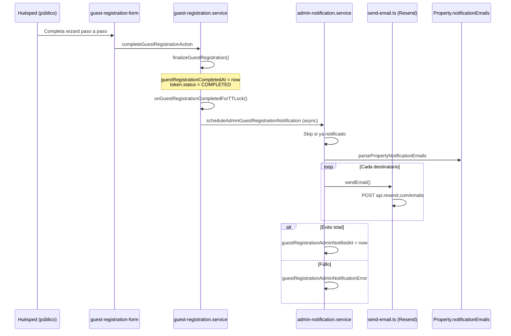

# Auditoría Fase 1 — Automatización de envío de Registro de Huéspedes a Administración del Edificio

| Campo | Valor |
|-------|-------|
| **Producto** | PRAGMA PMS |
| **Módulo** | Guest Registration |
| **Estado** | PENDIENTE DE APROBACIÓN (auditoría) |
| **Prioridad** | Alta |
| **Fecha** | 2026-07-16 |
| **Alcance** | Solo auditoría — **sin implementación** |

---

## Resumen ejecutivo

PRAGMA PMS **ya cuenta con un flujo automático de notificación a administración del edificio** al completar el registro de huéspedes. Fue introducido en la migración `20260602120000_guest_registration_admin_notify` y documentado como implementado en `docs/stabilization/10-final-release-report.md` (Refinement 8).

Sin embargo, la implementación actual es **parcial** respecto al documento de ejecución: cubre el disparador, el envío básico, la idempotencia mínima y la configuración por propiedad, pero **no cumple** varios requisitos funcionales clave (plantilla completa con acompañantes, reenvío manual, modelo de auditoría detallado, configuración granular, reintentos).

**Hipótesis del proceso manual persistente:**

1. Propiedades sin `notificationEmails` configurados → el sistema registra error pero no envía.
2. La plantilla actual solo incluye datos del titular y un conteo de huéspedes — **no lista acompañantes** con documento, nacionalidad ni fecha de nacimiento, que es lo que la administración del edificio suele exigir.
3. No hay UI de reenvío ni visibilidad del último envío en la reserva.
4. Fallos de envío aparecen en Novedades pero no hay acción de recuperación.
5. Posible desconocimiento operativo de que la automatización ya existe.

**Recomendación:** No construir infraestructura nueva. **Extender y endurecer** lo existente en Fases 2–3.

---

## 1. Auditoría del flujo

### 1.1 Arquitectura actual



### 1.2 Flujo operativo del huésped

| Etapa | Descripción | Archivo principal |
|-------|-------------|-------------------|
| Emisión de token | Al crear reserva elegible, liberar hold, sync iCal, o acción manual | `src/services/guests/guest-registration.service.ts` |
| Invitación al huésped | Email con enlace (si hay `guestEmail`) | `src/services/guests/guest-registration-email.service.ts` |
| Wizard público | `/guest-registration/[token]` — pasos `intro → register → hub → confirm → success` | `src/features/guests/components/guest-registration-form.tsx` |
| Registro por huésped | `registerGuestStep()` — titular primero, luego acompañantes | `guest-registration.service.ts` |
| Finalización | `completeGuestRegistration()` → `finalizeGuestRegistration()` | `guest-registration.service.ts` L748–825, L316–375 |

**Ruta pública (sin auth Clerk):** `src/proxy.ts` — `/guest-registration/(.*)`.

### 1.3 Estados del registro

#### Token (`GuestRegistrationStatus`)

| Estado | Significado | Transición |
|--------|-------------|------------|
| `ACTIVE` | Enlace válido, registro en curso | Creación del token |
| `COMPLETED` | Registro finalizado por el huésped | `finalizeGuestRegistration()` |
| `REVOKED` | Revocado por administrador | `revokeGuestRegistrationToken()` |
| `EXPIRED` | Definido en schema | **No usado** — `expiresAt` siempre `null` al crear |

#### Huésped individual (`ReservationGuestStatus`)

`PENDING_REGISTRATION | REGISTERED | VERIFIED | CHECKED_IN | CHECKED_OUT`

En el flujo actual, los huéspedes del wizard se crean con `REGISTERED`.

#### Reserva — campos de registro

| Campo | Rol |
|-------|-----|
| `guestRegistrationToken` | Token activo denormalizado |
| `guestRegistrationCompletedAt` | **Marca de registro completo** |
| `guestRegistrationAdminNotifiedAt` | Marca de envío exitoso a administración |
| `guestRegistrationAdminNotificationError` | Mensaje de error de envío (máx. 2000 chars) |

### 1.4 ¿Qué significa "Registro Completo"?

**Definición técnica:** El huésped confirma explícitamente en el paso `confirm` (`confirmAllGuests: true`). No basta con registrar todos los huéspedes permitidos.

**Condiciones en servidor (`completeGuestRegistration`):**

1. Token en estado `ACTIVE`.
2. Al menos 1 huésped registrado.
3. Exactamente 1 huésped con `isReservationOwner = true` (titular).
4. Confirmación explícita del huésped.

**Efectos al completar:**

- `guestRegistrationCompletedAt` se establece.
- Token pasa a `COMPLETED`, `usedAt` se registra.
- Contacto del titular se copia a `guestEmail` / `guestPhone`.
- Se dispara TTLock (`onGuestRegistrationCompletedForTTLock`).
- Se programa notificación a administración (`scheduleAdminGuestRegistrationNotification`).

**Importante:** Registro parcial (huéspedes guardados sin confirmar) deja `guestRegistrationCompletedAt = null` y token `ACTIVE`. El huésped puede retomar desde el paso `hub`.

### 1.5 Elegibilidad

Solo reservas con:

- **Plataforma:** `AIRBNB` o `DIRECT`
- **Estado:** `CONFIRMED`, `CHECKED_IN`, `CHECKOUT_TODAY`
- Sin `guestRegistrationCompletedAt` previo
- Con al menos 1 adulto o niño (capacidad > 0)

### 1.6 Eventos y consumidores downstream

| Consumidor | Detección | Impacto si se modifica completion |
|------------|-----------|-------------------------------------|
| TTLock Smart Access | `guestRegistrationCompletedAt` | Alto — acceso digital |
| Novedades timeline | `guestRegistrationCompletedAt` | Bajo — solo visualización |
| Inbox AI context | `guestRegistrationCompleted` boolean | Bajo |
| iCal / Airbnb enrichment | `guestFieldsLocked` cuando completado | Medio — no sobrescribe nombre |
| Operational feed alert | Fallo de admin notify | Bajo |
| Admin email | `finalizeGuestRegistration` hook | **Objetivo de esta tarea** |

**SIRE / TRA:** No hay integración directa con Guest Registration en el código auditado. Riesgo de impacto cruzado: **bajo**, siempre que los cambios se limiten al servicio de notificación y UI de reserva.

---

## 2. Auditoría de datos

### 2.1 Disponibilidad en base de datos

| Dato requerido | Modelo / campo | Disponible | En email actual |
|----------------|----------------|------------|-----------------|
| Código reserva | `Reservation.reservationCode` | ✅ | ✅ |
| Propiedad | `Property.name` + `unitNumber` → `formatPropertyLabel()` | ✅ | ✅ |
| Apartamento | `Property.unitNumber` (en label) | ✅ | ✅ |
| Check-in | `Reservation.checkIn` | ✅ | ✅ |
| Check-out | `Reservation.checkOut` | ✅ | ✅ |
| Número de huéspedes | `Reservation.guests.length` | ✅ | ✅ (solo conteo) |
| **Titular — nombre** | `ReservationGuest.fullName` (`isReservationOwner`) | ✅ | ✅ |
| **Titular — documento** | `documentType`, `documentNumber` | ✅ | ✅ |
| **Titular — tipo documento** | `documentType` → label | ✅ | ✅ |
| **Titular — nacionalidad** | `ReservationGuest.nationality` | ✅ | ❌ |
| **Titular — fecha nacimiento** | `ReservationGuest.dateOfBirth` | ✅ | ❌ |
| **Titular — email** | `ReservationGuest.email` | ✅ | ✅ |
| **Titular — teléfono** | `ReservationGuest.phone` | ✅ | ✅ |
| **Acompañantes — nombre** | `fullName` (no owner) | ✅ | ❌ |
| **Acompañantes — documento** | `documentType`, `documentNumber` | ✅ | ❌ |
| **Acompañantes — nacionalidad** | `nationality` | ✅ | ❌ |
| **Acompañantes — fecha nacimiento** | `dateOfBirth` | ✅ | ❌ |

**Conclusión:** Todos los datos existen en `ReservationGuest`. El servicio de notificación (`loadAdminNotificationContext`) **no selecciona** `nationality` ni `dateOfBirth`, y la plantilla **no itera acompañantes**.

### 2.2 Capacidad vs conteo

- **Capacidad de registro:** `adults + children` (infantes excluidos del límite).
- **Conteo mostrado al huésped:** `adults + children + infants`.
- Fuente: `src/lib/guest-registration/guest-registration-capacity.ts`.

---

## 3. Auditoría del sistema de correo

### 3.1 Servicio utilizado

| Aspecto | Implementación |
|---------|----------------|
| Proveedor | **Resend** (REST API directa, sin SDK npm) |
| Adaptador SSOT | `src/lib/email/send-email.ts` |
| Remitente | `EMAIL_FROM` o fallback `PRAGMA_BILLING_EMAIL` |
| API key | `RESEND_API_KEY` (plataforma global) |
| Dev sin key | Simulación (`ok: true`, `id: "simulated"`) |
| Prod sin key | Fallo duro (`ok: false`) |

### 3.2 Consumidores del adaptador

| Flujo | Archivo |
|-------|---------|
| Invitación registro (al huésped) | `guest-registration-email.service.ts` |
| **Notificación administración** | `guest-registration-admin-notification.service.ts` |
| Facturación | `billing-receipt-email.service.ts` |

### 3.3 Plantillas

| Email | Plantilla | Branding |
|-------|-----------|----------|
| Admin registro completado | `guest-registration-admin-notification.content.ts` | HTML inline básico, sin logo PRAGMA |
| Invitación huésped | Inline en `guest-registration-email.service.ts` | Básico |
| Facturación | `brand-email.ts` (`pragmaEmailHeaderHtml`, footer) | Completo |

**Tests existentes:** `tests/guests/guest-registration-admin-notification.test.ts` — solo contenido HTML y simulación de `sendEmail`. **No hay test de integración** del orquestador `notifyAdminGuestRegistrationCompleted()`.

### 3.4 Logging y reintentos

| Aspecto | Estado |
|---------|--------|
| Log consola | `[guest-registration-admin-notify]` + `[email]` |
| Auditoría persistente | Solo 2 campos en `Reservation` |
| Reintentos automáticos | **No** |
| Cola / cron de reintento | **No** (solo existe para inbound Airbnb) |
| ID de Resend guardado | **No** — se descarta tras `sendEmail()` |

**Patrón de referencia más maduro:** `billing-receipt-email.service.ts` — pre-check `invoiceEmailSentAt`, `updateMany` condicional, `writePaymentAuditLog()`.

### 3.5 Flujo de notificación admin (existente)

```
finalizeGuestRegistration()
  → scheduleAdminGuestRegistrationNotification()  [dynamic import, fire-and-forget]
    → notifyAdminGuestRegistrationCompleted(reservationId)
      → validar completedAt + no notifiedAt
      → parsePropertyNotificationEmails(property.notificationEmails)
      → buildGuestRegistrationAdminEmailHtml(payload)
      → sendEmail() por cada destinatario
      → éxito: guestRegistrationAdminNotifiedAt
      → fallo: guestRegistrationAdminNotificationError
```

---

## 4. Auditoría multi-tenant

### 4.1 Configuración actual

| Nivel | Campo | Uso |
|-------|-------|-----|
| **Propiedad** | `Property.notificationEmails` (JSON `[]`) | Destinatarios admin/recepción |
| **Propiedad** | `receptionWhatsapp` | WhatsApp — **no usado para email** |
| **Organización** | — | Sin emails de notificación por defecto |
| **Plataforma** | `RESEND_API_KEY`, `EMAIL_FROM` | Remitente global para todos los tenants |

**UI de configuración:** `property-form-drawer.tsx` — campo "Correos de administración / recepción" (textarea, un correo por línea).

**Parser:** `src/lib/property-notification-emails.ts` — normaliza, deduplica, valida formato.

### 4.2 Modelo "Edificio"

**No existe** entidad `Building` en Prisma. Cada unidad (`Property`) configura sus propios correos. Edificios con múltiples apartamentos requieren configurar cada propiedad por separado.

### 4.3 Gaps vs modelo de configuración solicitado

| Requisito del documento | Estado |
|-------------------------|--------|
| Correo recepción | ✅ Parcial — `notificationEmails` genérico |
| Correo administración | ✅ Mismo campo |
| Correo seguridad | ❌ No existe |
| Nombre recepción | ❌ No existe |
| Activo / Inactivo | ❌ No existe (vacío = error, no silencio) |
| Permitir reenvío | ❌ No existe |
| Enviar copia al administrador | ❌ No existe |
| Activar envío automático | ❌ Implícito siempre activo si hay emails |

---

## 5. Auditoría técnica — riesgos

### 5.1 Riesgo de correos duplicados

| Escenario | Riesgo | Mitigación actual |
|-----------|--------|-------------------|
| Doble llamada a `notifyAdminGuestRegistrationCompleted` | **Medio** | Early return si `guestRegistrationAdminNotifiedAt`; `updateMany WHERE notifiedAt IS NULL` |
| Condición de carrera concurrente | **Medio** | Ambos workers pueden enviar email antes de marcar `notifiedAt` |
| Fallo parcial multi-destinatario | **Medio** | Destinatario A recibe, B falla → error guardado; reintento futuro reenviaría a A |
| Paths legacy + actual | Bajo | `submitGuestRegistration()` y `completeGuestRegistration()` comparten hook |
| Reenvío manual | N/A | No implementado |

### 5.2 Riesgo de múltiples disparadores

Un solo punto de disparo post-commit: `finalizeGuestRegistration()` (y legacy `submitGuestRegistration()`). No hay cron ni webhook adicional. **Riesgo bajo** salvo concurrencia en el fire-and-forget async.

### 5.3 Impacto sobre otros módulos

| Módulo | Riesgo de regresión | Notas |
|--------|---------------------|-------|
| Guest Registration (wizard) | Bajo | Cambios deben limitarse a notificación, no al flujo de registro |
| Reservas | Bajo | Solo lectura de campos existentes + posible UI de reenvío |
| SIRE / TRA | Ninguno detectado | Sin acoplamiento |
| Facturación | Ninguno | Comparte `sendEmail` pero sin estado compartido |
| TTLock / Smart Access | Ninguno | Hook paralelo, independiente del email |
| Novedades | Bajo | Ya consume campos de error |
| iCal / Airbnb sync | Ninguno | |

### 5.4 Validaciones existentes vs requeridas

| Validación | Estado |
|------------|--------|
| Registro incompleto | ✅ Skip si no `guestRegistrationCompletedAt` |
| Correo inválido destinatario | ✅ `sendEmail` rechaza vacío; parser filtra inválidos |
| Sin correo configurado | ✅ Error persistido en reserva |
| Proveedor fuera de servicio | ✅ Error persistido; alerta Novedades |
| Timeout | Parcial — `fetch` sin timeout explícito |
| Reintentos | ❌ |
| Errores SMTP/API | ✅ Mensaje de Resend en `guestRegistrationAdminNotificationError` |

---

## 6. Componentes afectados (para Fases 2–3)

### 6.1 Ya implementados (reutilizar, no duplicar)

| Componente | Ruta |
|------------|------|
| Orquestador de notificación | `src/services/guests/guest-registration-admin-notification.service.ts` |
| Plantilla admin | `src/services/guests/guest-registration-admin-notification.content.ts` |
| Disparador post-completion | `src/services/guests/guest-registration.service.ts` → `scheduleAdminGuestRegistrationNotification` |
| Adaptador email | `src/lib/email/send-email.ts` |
| Parser destinatarios | `src/lib/property-notification-emails.ts` |
| Config UI propiedad | `src/features/properties/components/property-form-drawer.tsx` |
| Persistencia schema | `prisma/schema.prisma` — `notificationEmails`, `guestRegistrationAdminNotifiedAt`, `guestRegistrationAdminNotificationError` |
| Alerta operativa | `operational-feed.service.ts` + `operational-feed.mappers.ts` |
| Tests contenido | `tests/guests/guest-registration-admin-notification.test.ts` |

### 6.2 Por implementar o extender

| Componente | Fase | Descripción |
|------------|------|-------------|
| Plantilla HTML completa | 4 | Titular completo + tabla acompañantes + header PRAGMA |
| Reenvío manual en reserva | 6 | Botón + estado último envío en `reservation-detail-panel.tsx` |
| Server action reenvío | 6 | Nueva action con control de idempotencia / force |
| Configuración granular | 7 | Evaluar si basta extender `notificationEmails` o nuevos campos |
| Modelo auditoría | 2–3 | Tabla de intentos o ampliar campos (patrón billing) |
| Tests integración | 9 | Idempotencia, concurrencia, fallo parcial |
| Brand email | 4 | Reutilizar `src/lib/brand-email.ts` |

---

## 7. Matriz de cumplimiento vs documento de ejecución

| Fase | Requisito | Estado actual |
|------|-----------|---------------|
| 1 | Auditoría | ✅ Este documento |
| 2 | Diseño técnico | ⏳ Pendiente aprobación |
| 3 | Implementación infra existente | 🟡 **Parcial** — core existe |
| 4 | Plantilla HTML profesional | 🟡 Parcial — falta acompañantes, nacionalidad, DOB, header |
| 5 | Prevención duplicados | 🟡 Parcial — idempotencia básica, sin lock distribuido |
| 6 | Reenvío manual | ❌ No implementado |
| 7 | Configuración por propiedad | 🟡 Parcial — solo `notificationEmails` |
| 8 | Validaciones | 🟡 Mayoría cubierta, sin reintentos |
| 9 | Pruebas | 🟡 Unitarias básicas, sin E2E del flujo admin |
| 10 | Auditoría final | ⏳ Post-implementación |

---

## 8. Recomendación técnica (Fase 2)

### 8.1 Enfoque: extensión, no greenfield

No crear un segundo servicio de email ni un pipeline paralelo. **Extender** `notifyAdminGuestRegistrationCompleted` y su plantilla.

### 8.2 Evento disparador (mantener)

**Punto óptimo confirmado:** `finalizeGuestRegistration()` → `scheduleAdminGuestRegistrationNotification()`.

Razones:

- Garantiza que `guestRegistrationCompletedAt` ya está persistido.
- No bloquea la respuesta al huésped (async).
- Ya probado en producción.

No mover el disparador a un cron ni a un evento de dominio nuevo — añadiría latencia y complejidad sin beneficio.

### 8.3 Cambios propuestos por prioridad

#### P0 — Cerrar brecha funcional principal

1. **Enriquecer plantilla** con nacionalidad, fecha de nacimiento del titular y **tabla de acompañantes** (nombre, documento, nacionalidad, DOB).
2. **Reenvío manual** desde detalle de reserva:
   - Mostrar `guestRegistrationAdminNotifiedAt`, destinatarios, error si aplica.
   - Botón "Reenviar a administración" con `force: true` que limpia error y reintenta (con confirmación).
3. **Adoptar `brand-email.ts`** para header/footer PRAGMA PMS.

#### P1 — Endurecimiento

4. **Lock de envío:** usar `updateMany` al inicio con estado `SENDING` o advisory lock por `reservationId` para evitar carrera.
5. **Tracking por destinatario:** guardar resultado por email (JSON en reserva o tabla `GuestRegistrationAdminNotificationAttempt`).
6. **Reintento automático:** cron ligero que reprocese reservas con error en últimas 24h (máx. 3 intentos).

#### P2 — Configuración (evaluar necesidad real)

7. Separar destinatarios (admin / recepción / seguridad) **solo si el negocio lo exige** — de lo contrario, mantener `notificationEmails` multi-línea.
8. Toggle "activar envío automático" — útil para propiedades sin administración de edificio.

### 8.4 Modelo de auditoría recomendado

Opción mínima (sin migración pesada):

```typescript
// Ampliar JSON en Reservation o nuevo campo guestRegistrationAdminNotificationLog
{
  attempts: [
    {
      at: "ISO8601",
      recipients: ["a@b.com"],
      status: "success" | "partial" | "failed",
      providerIds: { "a@b.com": "resend_xxx" },
      error?: string,
      triggeredBy: "auto" | "manual",
      userId?: string
    }
  ]
}
```

Opción robusta: tabla dedicada `GuestRegistrationAdminNotification` (1:N con Reservation).

### 8.5 Restricciones respetadas

- No modificar flujo del wizard ni condiciones de completion.
- No tocar SIRE, TRA, facturación, iCal.
- Reutilizar `sendEmail`, `parsePropertyNotificationEmails`, campos Prisma existentes.
- Cambios aditivos en schema si se requiere log detallado.

---

## 9. Evidencia de archivos clave

| Archivo | Rol |
|---------|-----|
| `src/services/guests/guest-registration.service.ts` | SSOT del flujo; dispara notificación L374 |
| `src/services/guests/guest-registration-admin-notification.service.ts` | Envío a administración |
| `src/services/guests/guest-registration-admin-notification.content.ts` | Plantilla HTML |
| `src/lib/email/send-email.ts` | Adaptador Resend |
| `src/lib/property-notification-emails.ts` | Parser destinatarios |
| `src/features/properties/components/property-form-drawer.tsx` | Config UI |
| `src/features/reservations/components/reservation-detail-panel.tsx` | UI reserva (sin reenvío admin) |
| `prisma/migrations/20260602120000_guest_registration_admin_notify/migration.sql` | Migración original |
| `tests/guests/guest-registration-admin-notification.test.ts` | Tests unitarios |

---

## 10. Conclusión y siguiente paso

La automatización **ya existe en el núcleo del sistema** pero **no satisface el alcance completo** del documento de ejecución. El trabajo pendiente es principalmente de **completitud (datos en plantilla), operabilidad (reenvío, visibilidad) y robustez (concurrencia, auditoría, reintentos)** — no de crear un flujo nuevo desde cero.

**Acción requerida:** Aprobar esta auditoría para proceder a **Fase 2 — Diseño Técnico** con el enfoque de extensión descrito en §8.

---

*Documento generado en Fase 1. Sin cambios de código.*
