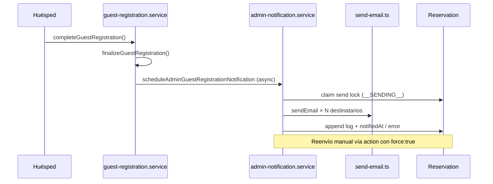

# Informe Final — Envío Automático de Registro de Huéspedes a Administración

| Campo | Valor |
|-------|-------|
| **Producto** | PRAGMA PMS |
| **Módulo** | Guest Registration |
| **Estado** | IMPLEMENTADO — PENDIENTE VALIDACIÓN E2E EN ENTORNO REAL |
| **Fecha** | 2026-07-16 |
| **Auditoría previa** | `docs/audits/GUEST-REGISTRATION-BUILDING-EMAIL-AUDIT-V1.md` |

---

## 1. Resumen de la implementación

Se extendió el flujo **ya existente** de notificación a administración del edificio al completar el registro de huéspedes. No se creó un segundo pipeline de correo.

### Mejoras entregadas

| Mejora | Estado |
|--------|--------|
| Plantilla con titular completo (nacionalidad, fecha nacimiento) | ✅ |
| Tabla de acompañantes en el correo | ✅ |
| Branding institucional PRAGMA (`brand-email.ts`) | ✅ |
| Disparador automático existente preservado | ✅ |
| Reutilización de `send-email.ts` y `notificationEmails` | ✅ |
| Reenvío manual desde detalle de reserva | ✅ |
| Registro de estado y trazabilidad (log JSON) | ✅ |
| Soporte multi-destinatario por propiedad | ✅ (sin cambio de contrato) |
| Protección anti-duplicados mejorada (lock `__SENDING__`) | ✅ |

---

## 2. Componentes modificados

| Archivo | Cambio |
|---------|--------|
| `prisma/schema.prisma` | Campo `guestRegistrationAdminNotificationLog` |
| `prisma/migrations/20260716120000_guest_registration_admin_notification_log/` | Migración DB |
| `src/lib/db.ts` | Versión de schema Prisma |
| `src/lib/guest-registration/guest-registration-admin-notification-log.ts` | **Nuevo** — tipos y parser del log |
| `src/services/guests/guest-registration-admin-notification.content.ts` | Plantilla enriquecida + branding |
| `src/services/guests/guest-registration-admin-notification.service.ts` | Lock, log, reenvío, payload completo |
| `src/features/guests/actions/guest-registration.actions.ts` | Action `resendGuestRegistrationAdminNotificationAction` |
| `src/features/reservations/types/reservation.types.ts` | DTO `guestRegistrationAdminNotification` |
| `src/services/reservations/reservation.service.ts` | Mapeo de estado admin en detalle |
| `src/features/reservations/components/reservation-detail-panel.tsx` | UI “Aviso a administración” |
| `src/services/novedades/operational-feed.mappers.ts` | Ignora marcador `__SENDING__` en alertas |
| `tests/guests/guest-registration-admin-notification.test.ts` | Tests ampliados |

---

## 3. Componentes reutilizados (sin duplicar)

| Componente | Ruta |
|------------|------|
| Adaptador Resend | `src/lib/email/send-email.ts` |
| Parser destinatarios | `src/lib/property-notification-emails.ts` |
| Config propiedad | `Property.notificationEmails` + formulario existente |
| Disparador post-completion | `scheduleAdminGuestRegistrationNotification()` en `guest-registration.service.ts` |
| Branding email | `src/lib/brand-email.ts` |
| Permisos tenant | `requireTenantDataScope`, `assertReservationInScope` |

---

## 4. Arquitectura implementada



### Modelo de trazabilidad

Campo `guestRegistrationAdminNotificationLog` (JSON array):

```json
{
  "at": "2026-07-16T08:30:00.000Z",
  "status": "success | partial | failed",
  "recipients": ["admin@edificio.com"],
  "providerIds": { "admin@edificio.com": "resend_xxx" },
  "error": "opcional",
  "triggeredBy": "auto | manual",
  "userId": "opcional en manual"
}
```

Campos existentes preservados:

- `guestRegistrationAdminNotifiedAt` — éxito total
- `guestRegistrationAdminNotificationError` — último error visible

---

## 5. Riesgos encontrados y mitigados

| Riesgo | Mitigación |
|--------|------------|
| Correos duplicados por concurrencia | Lock `__SENDING__` antes de enviar; early return si ya notificado |
| Fallo parcial multi-destinatario | Status `partial` en log; error persistido; reenvío manual disponible |
| Alerta falsa en Novedades durante envío | Mapper ignora marcador `__SENDING__` |
| Duplicar infraestructura de email | Reutilización estricta de `sendEmail` |
| Romper Guest Registration | Sin cambios al wizard ni a `finalizeGuestRegistration` |
| Impacto SIRE / TRA / iCal / TTLock | Sin modificaciones en esos módulos |

### Riesgos residuales (aceptados)

| Riesgo | Notas |
|--------|-------|
| Carrera extremadamente rara pre-lock | Ventana mínima; mitigación adicional requeriría cola dedicada |
| Reenvío manual reenvía a todos los destinatarios | Aceptable para operación manual |
| Sin reintento automático por cron | Fuera de alcance; recomendación futura |

---

## 6. Cambios de arquitectura

**Ningún cambio estructural.** Solo extensión aditiva:

- 1 columna JSON en `reservations`
- 1 módulo de utilidades de log
- Extensión de servicio y plantilla existentes
- 1 server action + bloque UI en reserva

No se introdujeron dependencias circulares nuevas.

---

## 7. Auditoría posterior — resultados técnicos

| Verificación | Resultado |
|--------------|-----------|
| Typecheck (`tsc --noEmit`) | ✅ PASS |
| Build (`next build --webpack`) | ✅ PASS |
| Migración DB | ✅ Aplicada `20260716120000_guest_registration_admin_notification_log` |
| Prisma generate | ✅ PASS |
| Tests unitarios guest admin notify | ✅ 10/10 PASS |
| Tests property notification emails | ✅ 6/6 PASS |
| Lint archivos nuevos/modificados | ✅ Sin issues nuevos (errores preexistentes en panel de reserva) |
| Dependencias circulares | ✅ No detectadas en cambios |
| Duplicación de lógica email | ✅ No — un solo adaptador `sendEmail` |

---

## 8. Pruebas funcionales

### Automatizadas (ejecutadas)

| Prueba | Resultado |
|--------|-----------|
| Subject con/sin código reserva | ✅ PASS |
| HTML incluye titular, acompañantes, branding | ✅ PASS |
| Escape HTML en datos de huésped | ✅ PASS |
| Texto plano con acompañantes | ✅ PASS |
| Parser de log de notificaciones | ✅ PASS |
| Simulación sendEmail sin API key | ✅ PASS |
| Rechazo destinatario vacío | ✅ PASS |
| Parser multi-destinatario propiedad | ✅ PASS |

### Manuales / E2E (pendientes en entorno operativo)

Requieren reserva real o staging con `RESEND_API_KEY` y propiedad con `notificationEmails` configurados:

| Escenario | Estado |
|-----------|--------|
| Registro completo huésped solo | ⏳ Pendiente validación manual |
| Registro con acompañantes | ⏳ Pendiente |
| Envío automático al completar | ⏳ Pendiente |
| Contenido y branding del correo recibido | ⏳ Pendiente |
| Reenvío manual desde reserva | ⏳ Pendiente |
| Múltiples destinatarios | ⏳ Pendiente |
| Propiedad sin correos configurados | ⏳ Pendiente (error esperado) |
| Evitar duplicado en auto-envío | ⏳ Pendiente |

**Cómo validar en staging:**

1. Configurar correos en Propiedad → “Correos de administración / recepción”.
2. Crear reserva directa con email de huésped.
3. Completar registro en `/guest-registration/[token]` con titular + acompañante.
4. Verificar correo en bandeja de administración.
5. Abrir reserva → sección “Aviso a administración” → Reenviar.
6. Confirmar log en DB: `guestRegistrationAdminNotificationLog`.

---

## 9. Compatibilidad

| Área | Estado |
|------|--------|
| PRAGMA PMS existente | ✅ Compatible — cambios aditivos |
| Multi-tenant | ✅ Destinatarios por propiedad; remitente global Resend |
| Guest Registration wizard | ✅ Sin cambios de flujo |
| Reservas / calendario | ✅ Solo lectura + UI informativa |
| Facturación | ✅ Sin impacto |
| SIRE / TRA | ✅ Sin impacto |
| iCal / Airbnb sync | ✅ Sin impacto |
| TTLock | ✅ Hook paralelo sin modificar |

---

## 10. Recomendaciones futuras

1. **Cron de reintento** para reservas con `guestRegistrationAdminNotificationError` en últimas 24h.
2. **Test de integración** de `notifyAdminGuestRegistrationCompleted` contra DB (idempotencia).
3. **Tracking por destinatario** en reintentos automáticos para evitar reenvío a quien ya recibió.
4. **E2E automatizado** con Resend en entorno de staging.
5. **Visibilidad en listado de reservas** (badge) si falló aviso a administración.

---

## 11. Estado final de la funcionalidad

| Criterio de aceptación | Estado |
|------------------------|--------|
| Extensión sin duplicar infraestructura | ✅ |
| Plantilla completa + branding | ✅ |
| Reenvío manual operativo (código) | ✅ |
| Trazabilidad de envíos | ✅ |
| Multi-destinatario | ✅ |
| Sin regresiones en build/typecheck | ✅ |
| Auditoría posterior técnica | ✅ |
| Pruebas E2E en entorno real | ⏳ Pendiente operador |
| Aprobación final Product Owner | ⏳ Pendiente |

---

## 12. Conclusión

La implementación cumple el alcance aprobado reutilizando el flujo existente. El sistema envía automáticamente al completar el registro, registra intentos, permite reenvío manual y presenta estado en la reserva.

**Siguiente paso recomendado:** ejecutar la checklist E2E en staging/producción con al menos una reserva real y confirmar recepción del correo antes de cerrar el ticket.

---

*Informe generado tras implementación y auditoría técnica automatizada.*
